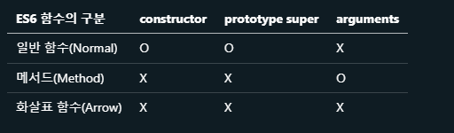

# 23 실행 컨텍스트

실행컨텍스트는 식별자(변수, 함수, 클래스 등의 이름)를 등록하고 관리하는 스코프와 코드 실행 순서 관리를 구현한 내부 매커니즘.

실행 컨텍스트는 소스코드를 실행하는데 필요한 환경을 제공하고 코드의 실행 결과를 실제로 관리하는 영역

식별자와 스코프는 실행 컨텍스트의 "렉시컬 환경"으로 관리하고
코드 실행 순서는 "실행 컨텍스트 스택"으로 관리한다.

| 소스코드의 타입 | 설명                                                                                        |
| --------------- | ------------------------------------------------------------------------------------------- |
| 전역 코드       | 전역에 존재하는 소스코드. (cf. 전역에 정의된 함수, 클래스 등의 내부 코드는 X)               |
| 함수 코드       | 함수 내부에 존재하는 소스코드. (cf. 함수 내부에 중첩된 함수, 클래스 등의 내부 코드는 포함X) |
| eval 코드       | 빌트인 전역 함수인 eval 함수에 인수로 전달되어서 실행되는 소스코드                          |
| 모듈 코드       | 모듈 내부에 존재하는 소스코드. (cf. 모듈 내부의 함수, 클래스 등의 내부 코드 포함 X)         |

-> 타입에 따라서 실행 컨텍스트르르 생성하는 과정과 관리 내용이 다르다.

---

## 소스코드 평가 , 실행

```javascript
var x;
x = 1;
```

1. 소스코드 평가 과정 중 실행컨텍스트 생성
2. 변수, 함수등의 선언문만 실행

   -> var x; 실행

3. 실행 컨텍스트가 관리하는 스코프에 등록

   -> x 실행 컨텍스트가 관리하는 스코프에 등록되고 undefined로 초기화

4. 소스코드 실행(런타임 시작)
5. 변수, 함수의 참조를 실행 컨텍스트가 관리하는 스코프에서 검색해서 취득

   -> x가 선언된 변수인지 스코프에서 확인

6. 변수 값의 변경, 소스코드의 실행 결과 실행 컨텍스트가 관리하는 스코프에 등록

   -> x가 선언되어있느면 값을 할당하고 실행 컨텍스트에 등록

---

```javascript
// 전역 변수 선언
const x = 1;
const y = 2;

// 함수 정의
function foo(a) {
  // 지역 변수 선언
  const x = 10;
  const y = 20;

  // 메서드 호출
  console.log(a + x + y); // 130
}

// 함수 호출
foo(100);

// 메서드 호출
console.log(x + y); // 3
```

순서

1. 전역 코드 평가
2. 전역 코드 실행
3. 함수 코드 평가
4. 함수 코드 실행

## 실행 컨텍스트 스택

코드의 실행순서를 관리한다.

```javascript
const x = 1;

function foo() {
  const y = 2;

  function bar() {
    const z = 3;
    console.log(x + y + z);
  }
  bar();
}

foo(); // 6
```

1. 전역 코드 평가 실행
2. foo함수 코드 평가 실행
3. bar함수 코드 평가 실행
4. bar 함수 종료 pop -> foo 함수로 복귀
5. foo 함수 종료 pop -> 전역 코드로 복귀

## 렉시컬 환경

스코프와 식별자를 관리한다.

식별자와 식별자에 바인딩된 값. 상위 스코프에 대한 참조를 기록하는 자료구조

### LexicalEnvironment, VariableEnvironment

실행 컨텍스트는 LexicalEnvironment 컴포넌트와 VariableEnvironment 컴포넌트로 구성되는데 이 책에서는 구분하지 않고 렉시컬 환경으로 통일해 설명한다.

### EnvironmentRecord, OuterLexicalEnvironmentReference

렉시컬 환경은 두 개의 컴포넌트로 구성된다.

| 환경 레코드                  | 스코프에 포함된 식별자를 등록하고 등록된 식별자에 바인딩된 값을 관리하는 저장소                                                                                                                     |
| ---------------------------- | --------------------------------------------------------------------------------------------------------------------------------------------------------------------------------------------------- |
| 외부 렉시컬 환경에 대한 참조 | 상위 스코프를 가리킨다. 상위 스코프란 외부 렉시컬 환경, 즉 해당 실행 컨텍스트를 생성한 소스코드를 포함하는 상위 코드의 렉시컬 환경을 말함. 이를 통해 단방향 링크드 리스트인 스코프 체인을 구현한다. |

실행 컨텍스트의 생성과 식별자 검색 과정

```javascript
var x = 1;
const y = 2;

function foo(a) {
  var x = 3;
  const y = 4;

  function bar(b) {
    const z = 5;
    console.log(a + b + x + y + z);
  }
  bar(10);
}

foo(20); // 42
```

### 1. 전역객체 생성

전역 코드가 평가 되기 이전에 생성되어 빌트인 전역 프로퍼티와 빌트인 전역함수, 표준 빌트인 객체가 추가되며 특정 환경의 호스트 객체를 포함한다.

전역 객체 또한 Object.prototype을 상속받는 프로토타입 체인의 일원이다.

```javascript
// Object.prototype.toString
window.toString(); // -> "[object Window]"

window.__proto__.__proto__.__proto__.__proto__ === Object.prototype; // -> true
```

### 2. 전역 코드 평가

#### 2.1 전역 실행 컨텍스트 생성

비어있는 전역 실행 컨텍스트 생성. 실행 컨텍스트 스택에 푸시
전역 실행 컨택스트는 실행 컨택스트 스택의 최상위

#### 2.2 전역 렉시컬 환경 생성

전역 렉시컬 환경을 생성. 전역 실행 컨텍스트에 바인딩
전역 환경 레코드는 전역 변수를 관리하는 전역 스코프, 전역 객체의 빌트인 전역 프로퍼티와 빌트인 전역함수, 표준 빌트인 객체 제공

ES6이전에 전역 객체가 전역 환경 레코드의 역할을 수행

#### 2.2.1. 객체 환경 레코트 생성

기존 전역 객체가 관리하던 var 키워드로 선언한 전역 변수와 함수선언물으로 인한 전역 함수, 빌트인 전역 프로퍼티와 빌트인 전역함수, 표준 빌트인 객체 관리

전역 환경 레코드를 구성하는 컴포넌트인 객체 환경 레코드는 BindingObject(전역객체 생성시 생성된 전역객체)라고 부르는 객체와 연결된다.
var키워드로 선언한 전역 변수, 함수 선언문으로 정의된 전역 함수는 BindingObject를 통해서 전역 객체의 프로퍼티와 메서드가 된다.

```javascript

var x = 1;
const y = 2;

function foo (a) {
...
```

#### 2.2.2. 선언적 환경 레코드 생성

let, const 키워드로 선언한 전역 변수 관리.

let,const 키워드로 선언한 전역변수는 전역 객체의 프로퍼티가 되지 않고 개념적인 블록 내에 존재하게 된다고 했는데 그 개념적인 블록이 바로 전역 환경 레코드의 선언적 환경 레코드이다.

const 키워드는 선언 단계와 초기화 단계가 분리되기 때문에 변수 선언문에 도달하기 전까지 일시적 사각지대에 빠지게 된다.

#### 2.3. this바인딩

일반적으로 전역 코드에서 this는 전역 객체를 가리킴. 전역 환경 레코드의 [[GlobalThisValue]] 내부 슬롯에는 전역 객체가 바인딩 된다. this바인딩은 전역 환경 레코드와 함수 환경 레코드에만 존재 (객체환경 레코드와 선언적 환경 레코드에는 this 바인딩 X)

#### 2.4. 외부 렉시컬 환경에 대한 참조 결정정

전역 렉시컬 환경의 외부 렉시컬 환경에 대한 참조는 null이다.(전역 렉시컬 환경이 스코프 체인의 종점에 존재함을 의미)

### 3. 전역코드 실행

코드가 순차적으로 실행된다. 이 과정에서 동일한 이름의 식별자가 다른 스코프에 여러개 존재하는 경우가 있는데, 어느 스코프를 참조할 지 결정하는 것을 식별자 결정이라고 한다.

식별자 결정을 위해 식별자를 검색할 때는 실행중인 실행 컨텍스트에서 식별자를 검색하기 시작한다.

### 4.foo함수 코드평가

foo 함수가 호출되면 전역 코드의 실행을 중지하고 foo 함수 내부로 코드의 제어권이 이동한다. 그 이후에 함수 코드를 평가하기 시작하며 아래의 순서대로 진행이 된다.

1. 함수 실행 컨텍스트 생성: 생성된 함수 실행 컨텍스트는 함수 렉시컬 환경이 완성된 다음 실행 컨텍스트에 푸시된다.

2. 함수 렉시컬 환경 생성: 렉시컬 환경을 생성하고 foo 함수 실행 컨텍스트에 바인딩 한다.(환경 레코드와 외부 렉시컬 환경에 대한 참조로 구성)

- 함수 환경 레코드 설정: 매개변수, arugments 객체, 함수 내부에서 선언한 지역 변수와 중첩 함수를 등록하고 관리한다.

- this 바인딩: 일반함수로 호출 되었으므로 전역 객체를 가리킨다.

- 외부 렉시컬 환경에 대한 참조 결정: foo 함수 정의가 전역 코드 평가 시점에 평가되어 이 시점의 실행중인 실행 컨ㅌ켁스트는 전역 실행 컨텍스트이므로 외부 렉시컬 환경에 대한 참조에는 전역 렉시컬 환경의 참조가 할당된다. 함수의 상위 스코프를 함수 객체의 내부 슬롯 [[Environment]]에 저장하는데, 이것이 외부 렉시컬 환경에 대한 참조에 할당되는 것이며 렉시컬 스코프를 구현하는 메커니즘이다.

### 5. foo 함수 코드 실행

### 6. bar 함수 코드 평가

foo 함수 코드 평가와 동일하게 이루어짐

### 7. bar 함수 코드 실행

거의 foo 함수 코드와 비슷하게 이루어지며, 여기서 console.log(a + b + x + y+ z)의 경우 다음의 순서로 이루어진다.

console식별자 검색: 식별자를 검색하다가 최종적으로 전역 렉시컬 환경의 객체 환경 레코드의 BindingObject에서 찾는다.

log 메서드 검색: 프로토타입 체인을 통해 메서드 검색(console 객체가 직접 소유하는 프로퍼티)

a + b + x + y + z 표현식의 평가

console.log 메서드 호출

### 8. bar 함수 코드 실행 종료

bar 함수 실행 컨텍스트가 실행 컨텍스트 스택에서 pop되어 제거되고 foo 실행 컨텍스트가 실행 중인 실행 컨텍스트가 됨 --> 실행 컨텍스트가 제거 되었다고 해서 렉시컬 환경 까지 즉시 소멸하는 것이 아닌 가비지 컬렉터에 의해 메모리 공간의 확보가 해제 될때 까지 남아 있음. 누군가 참조하고 있다면 bar 렉시컬 환경은 소멸하지 않는다.

### 9. foo 함수 코드 실행 종료

foo 함수 실행 컨텍스트가 pop 되어 제거되고, 전역 실행 컨텍스트가 실행 중인 실행 컨텍스트가 된다.

### 10. 전역 코드 실행 종료

마찬가지로 전역 실행 컨텍스트가 pop되어 실행컨텍스트 스택에는 아무것도 남아있지 않게 된다.

## 실행 컨텍스트와 블록 레벨 스코프

전역 소스 코드에서 블록문의 경우 변수가 선언되었을 시, 렉시컬 환경을 새롭게 생성하여 기존의 전역 렉시컬 환경을 교체하고, 이때 이 렉시컬 환경의 외부 렉시컬 환경에 대한 참조는 전역 렉시컬 환경을 가리킨다.

전역 소스 코드에서 블록문의 경우 변수가 선언되었을 시, 렉시컬 환경을 새롭게 생성하여 기존의 전역 렉시컬 환경을 교체하고, 이때 이 렉시컬 환경의 외부 렉시컬 환경에 대한 참조는 전역 렉시컬 환경을 가리킨다.

# 24장 클로저

클로저는 반환된 내부함수가 자신이 선언됐을 때의 환경(Lexical environment)인 스코프를 기억하여 자신이 선언됐을 때의 환경(스코프) 밖에서 호출되어도 그 환경(스코프)에 접근할 수 있는 함수를 말한다. 이를 조금 더 간단히 말하면 클로저는 자신이 생성될 때의 환경(Lexical environment)을 기억하는 함수

---

```javascript
const x = 1;

function outerFunc() {
  const x = 10;

  function innerFunc() {
    console.log(x); // 10
  }

  innerFunc();
}

outerFunc();
```

함수 outerFunc 내에서 내부함수 innerFunc가 선언되고 호출되었다. 이때 내부함수 innerFunc는 자신을 포함하고 있는 외부함수 outerFunc의 변수 x에 접근할 수 있다. 이는 함수 innerFunc가 함수 outerFunc의 내부에 선언되었기 때문이다.

```javascript
const x = 1;

function outerFunc() {
  const x = 10;
  innerFunc();
}

function innerFunc() {
  console.log(x); // 1
}

outerFunc();
```

중첩 함수가 아니면 outerFunc함수의 내부에서 호출한다 해도 outerFunc함수의 변수에 접근할 수 없다.

이유는 함수를 어디에 정의했는지에 따라 상위 스코프를 결정하는 렉시컬 스코프 때문이다.

## 함수 객체의 내부 슬롯 [[Environment]]

함수는 자신의 내부 슬롯[[Environment]]에 자신이 정의된 환경, 즉 상위 스코프의 참조를 저장한다.

함수 객체의 내부 슬롯 [[Environment]]에 저장된 현재 실행 중인 실행 컨텍스트의 렉시컬 환경의 참조가 바로 상위 스코프이다. 또한 자신이 호출되었을 때, 생성될 함수의 렉시컬 환경의 "외부 렉시컬 환경에 대한 참조"에 저장될 참조값이다. 함수 객체는 상위 스코프를 자신이 존재하는 한 기억한다.

## 클로저와 렉시컬 환경

```javascript
const x = 1;

// ①
function outer() {
  const x = 10;
  const inner = function () {
    console.log(x);
  }; // ②
  return inner;
}

// outer 함수를 호출하면 중첩 함수 inner를 반환한다.
// 그리고 outer 함수의 실행 컨텍스트는 실행 컨텍스트 스택에서 팝되어 제거된다.
const innerFunc = outer(); // ③
innerFunc(); // ④ 10
```

외부 함수보다 중첩 함수가 더 오래 유지 되는 경우 중첩함수는 이미 생명 주기가 종료된 외부 함수의 변수를 참조할 수 있다. 이러한 중첩 함수를 클로저라고 한다.

## 클로저의 활용

상태를 안전하게 변경하고 유지하기 위해서 사용한다. 상태를 안전하게 은닉하고 특정함수에게만 상태 변경을 허용

```javascript
/// 카운트 상태 변경 함수
const increase = function () {
  // 카운트 상태 변수
  let num = 0;

  // 카운트 상태를 1만큼 증가 시킨다.
  return ++num;
};

// 이전 상태를 유지하지 못한다.
console.log(increase()); // 1
console.log(increase()); // 1
console.log(increase()); // 1
```

## 캡슐화와 정보 은닉

캡슐화: 프로퍼티와 메서드를 하나로 묶는 것. 보통 특정 프로퍼티나 메서드를 감출 목적으로 사용하기도하는데 이를 정보 은닉이라고 한다.

## 자주 발생하는 실수

클로저를 사용할 때 자주 발생하는 실수를 보여주는 예제다.

```javascript
var funcs = [];

for (var i = 0; i<3; i++) {
  funcs[i] = function () {return i; };
}

for (var j = 0; j<funcs.length; j++) {
  console.log(funcs[j]());

```

0,1,2 가 아니라 3,3,3이 출력된다.

```javascript
var funcs = [];

for (var i = 0; i< 3; i++) {
  funcs[i] = (function id) {
    return function () {
      return id;
    };
  }(i));
}

for (var j = 0; j < funcs.length; j++) {
  console.log(funcs[j]());
}
```

# 26장 ES6함수의 추가 기능

## 함수의 구분

ES6 이전의 함수는 동일한 함수라도 다양한 형태로 호출할 수 있었다.

```javascript
var foo = function () {
  return 1;
};

// 일반함수
foo(); // 1

// 생성자 함수로서 호출
new foo(); // foo {}

// 메서드로서 호출
var obj = { foo: foo };
obj.foo(); // 1
```

위와 같이 함수를 여러 형태로 호출하게 되면 실수를 유발하고 성능상에도 좋지 않다.

ES6에서 함수의 사용목적에 따른 3가지 종류로의 구분



## 메서드

ES6 사양에서 메서드는 메서드 축약 표현으로 정의된 함수만을 의미한다.

```javascript

const obj = {
  // 메서드로 정의
  foo () { return 1; }

  // 일반 함수처럼 정의
  bar: function () { return 1;}
}
```

## 화살표 함수

표현만 간략한 것이 아닌 내부 동작또한 기존함수보다 간략하며 콜백 함수 내부의 this가 전역 객체를 가리키는 문제를 상위스코프를 가리킴으로써 해결

```javascript
const arrow = (x, y) => x + y;

const arrow = x => return x;

const arrow = () => { ... };
```

화살표 함수 또한 일급 객체이므로 고차함수에 인수로 전달할 수 있는데, 이 경우 일반적인 함수 표현식보다 표현이 간결하고 가독성이 좋다.

### 화살표 함수와 일반 함수의 차이

- 화살표 함수는 인스턴스를 생성할 수 없는 non-constructor이다. --> prototype 프로퍼티와 프로토타입 생성 X

- 중복된 매개변수 이름을 선언할 수 없다. --> strict mode에선 일반함수도 중복된 매개변수 사용 불가

- 화살표 함수는 함수 자체의 this, arguments, super, new.target 바인딩을 갖지 않는다. --> 스코프 체인을 통한 상위 스코프의 요소 참조

### this

콜백함수가 일반함수라면 그 안의 this는 전역 객체를 가리키고, class 내부라면 자동적으로 strict mode가 적용되어 undefined를 가리킨다.

이 경우 this를 제대로 바인딩 시키기 위해서는 const that = this를 사용하거나 this를 함수의 인수로 전달하거나, bind메서드를 사용하여야 하는데 화살표 함수를 사용하면 그런거 없이도 간단하게 해결이 가능하다!

화살표 함수는 함수 자체의 this 바인딩을 갖지 않고 따라서 화살표 함수 내부에서 this를 참조하면 상위 스코프 this를 그대로 참조한다. 이를 lexical this라 한다.

### super

화살표 함수는 함수 자체 super 바인딩을 갖지 않아서 화살표 함수 내부에서 super 참조 시 this와 마찬가지로 상위 스코프의 super를 참조한다. --> 만약 클래스 필드에서 정의가 된 화살표 함수라면 constructor 내부의 super 바인딩을 참조하는 것과 같다.

### arugments

자체적인 arugments 바인딩을 갖지 않고 상위 스코프의 arugments를 참조한다.

## Rest

REST 파라미터는 함수에 전달된 인수들의 목록을 배열로 전달받는다.

```javascript
function foo(...rest) {
  console.log(rest); // [1, 2, 3, 4, 5]
}

foo(1, 2, 3, 4, 5);
```

하나의 Rest 파라미터만 사용할 수 있다.
함수 정의 시 선언한 매개변수의 개수를 나타내는 length 프로퍼티에 영향을 주지 않는다.

### Rest 파라미터와 arguments 객체

arguments 객체는 유사배열 객체여서 배열 메서드를 사용하려면 배열로 변환해야하지만 rest 파라미터의 경우 배열로 인수를 직접 전달 받기 때문에 배열 메서드 사용 시 배열로 변환할 필요가 없다.

화살표 함수는 arguments를 갖지 않으므로 무조건 rest 파라미터 사용해야함!(가변 인자 함수 구현 시)

## 매개변수 기본값

인수가 전달되지 않으면 기본값이 undefined이기 때문에 예기치 않은 결과를 초래할 수 있어서 다음과 같이 사용한다.

```javascript
function sum(x = 0, y = 0) {
  return x + y;
}

console.log(sum(1, 2)); // 3
console.log(sum(1)); // 1

console.log(sum.length); // 0
```
