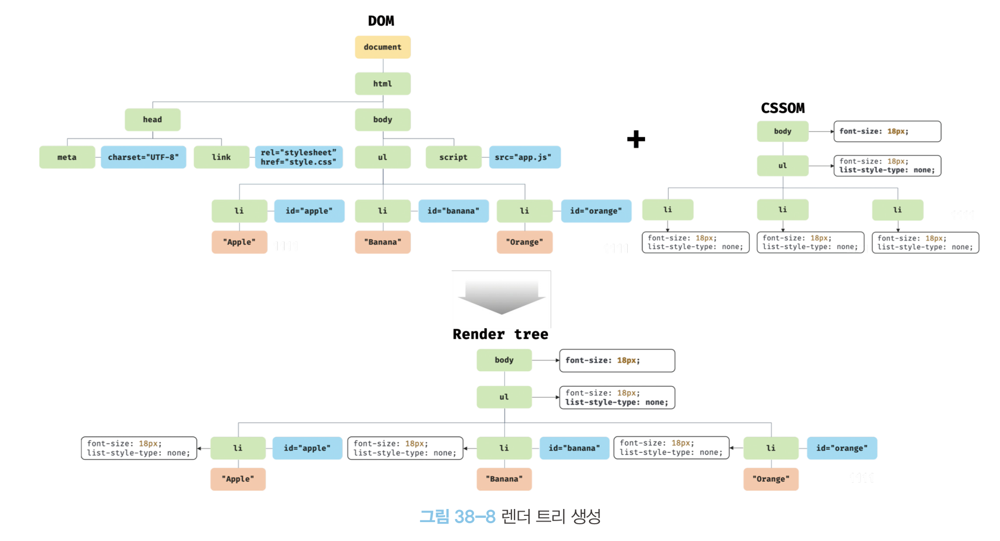
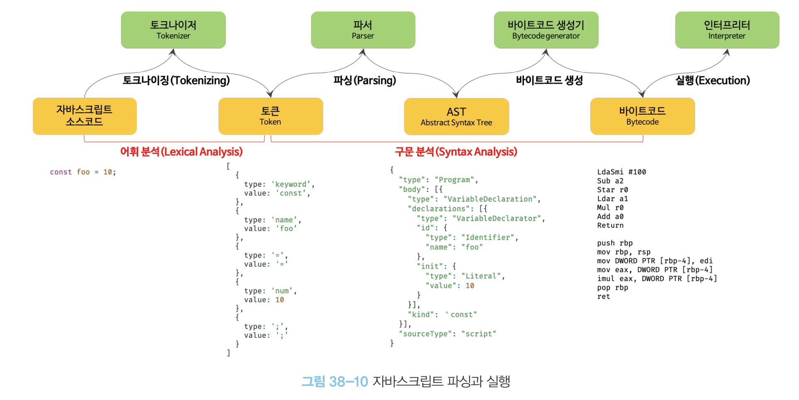

# 38장 브라우저의 렌더링 과정

- 브라우저가 HTML, CSS, JS로 작성된 텍스트 문서를 어떻게 파싱하여 브라우저에 렌더링하는가?
- 파싱(구문 분석): 텍스트 문서를 실행하기 위해 텍스트 문서의 문자열을 토큰으로 분해하고, 토큰에 문법적 의미와 구조를 반영하여 트리 구조의 자료구조인 파스 트리를 생성하는 일련의 과정
- 렌더링: 문서를 파싱하여 브라우저에 시각적으로 출력하는 것

- 렌더링 과정
  1. 브라우저가 렌더링에 필요한 리소스(HTML, CSS, JS, 이미지 등)를 요청하고 서버로부터 응답을 받음
  2. 응답받은 HTML/CSS를 파싱하여 DOM/CSSOM을 구성하고 렌더 트리 생성
  3. 응답받은 JS를 파싱하여 AST(Abstract Syntax Tree)를 생성하고 바이트코드로 변환하여 실행  
     이때, JS는 DOM API를 통해 DOM/CSSDOM 변경 가능
  4. 렌더 트리를 기반으로 레이아웃을 계산하고 브라우저 화면서 HTML 요소를 띄움(페인팅)

## 38.1 요청과 응답

- 렌더링에 필요한 리소스는 모두 서버에 존재
- 서버에 요청을 전송하기 위해 브라우저는 주소창을 제공  
  URL 입력 -> DNS를 통해 IP주소로 변환 -> IP주소를 통해 서버에게 요청 전송
- 루트 요청에는 루트 폴더의 index.html을 클라이언트로 응답
- 서버와 요청/응답한 내용은 개발자 도구의 Network 패널에서 확인 가능

## 38.2 HTTP 1.1과 HTTP 2.0

- HTTP: 웹에서 브라우저와 서버가 통신하기 위한 프로토콜(규약)
- HTTP/1.1  
  커넥션당 하나의 요청/응답만 처리(img, link, script 태그 등 요청이 개별전 전송/응답)
  리소스의 동시 전송이 불가하므로 리소스 개수에 비례하여 응답 시간도 증가
- HTTP/2.0  
  커넥션당 여러 개의 요청/응답 가능
  HTTP/1.1에 비해 페이지 로드 속도가 약 50% 빠름

## 38.3 HTML 파싱과 DOM 생성

- HTML은 문자열로 이루어진 순수한 텍스트  
  이를, 브라우저에서 시각적인 픽셀로 렌더링하기 위해서는 브라우저가 이해할 수 있는 자료구조로 변환 필요
- 브라우저 렌더링 엔진은 다음 과정을 통해 DOM을 생성
  
  1. 브라우저가 요청한 HTML 파일은 인터넷 경우 시 바이트(2진수)로 전달됨
  2. meta 태그의 인코딩 방식을 기준으로 바이트를 문자열로 변환(인코딩 방식은 헤더에 담겨 응답)
  3. 문자열을 문법적 의미를 갖는 코드의 최소 단위인 토큰들로 분해
  4. 각 토큰들을 객체로 변환하여 내용에 따라 각 노드로 구성(노드는 DOM의 기본 요소)
  5. HTML 요소는 중첩 관계를 가지며 이를 반영하여 모든 노드들은 트리 자료구조(DOM)를 구성
- 즉, DOM(Document Object Model)은 HTML 문서를 파싱한 결과물

## 38.4 CSS 파싱과 CSSOM 생성

- DOM을 생성하다가 CSS를 로드하는 link/style 태그를 만나면 DOM 생성 일시 중단
- 태그의 지정된 CSS 파일을 요청하고 HTML과 동일한 파싱 과정을 거치며 해석하여 CSSOM 생성
- 이후, 일시 중단한 DOM 생성 재개

## 38.5 렌더 트리 생성

- DOM/CSSOM은 렌더링을 위해 렌더 트리로 결합
- 렌더링을 위한 자료구조로 화면에 렌더링되지 않는 노드와 CSS에 비표시되는 노드는 미포함
  
- 완성된 렌더 트리는 레이아웃 계산에 사용되며 브라우저 화면에 픽셀을 렌더링하는 페인팅 처리에 입력됨
- 레이아웃 계산과 페인팅을 다시 실행하는 리렌더링은 비용이 많이드는 작업으로 주의 필요

## 38.6 자바스크립트 파싱과 실행

- DOM은 HTML 문서 구조와 정보, HTML 요소와 스타일 등을 변경할 수 있는 프로그래밍 인터에피스로서 DOM API 제공  
  즉, DOM API로 이미 생성된 DOM을 동적으로 변경 가능
- CSS 파싱과 마찬가지로 JS 파일을 로드하는 코드를 만나면 DOM 생성 일시 중단
- JS 파싱과 실행은 브라우저 렌더링 엔진이 아닌 JS 엔진이 처리
- JS 엔진은 DOM/CSSOM을 생성하듯 JS를 해석하여 AST를 생성
- AST를 기반으로 인터프리터가 실행할 수 있는 중간코드인 바이트코드를 생성하여 실행
  
- 토크나이징: 단순한 문자열인 소스코드를 어휘 분석하여 문법적 의미를 갖는 코드의 최소 단위인 토큰들로 분해

## 38.7 리플로우와 리페인트

- DOM API가 사용되어 DOM/CSSOM이 변경되면 렌더 트리가 변경되고 이를 기반으로 레이아웃, 페인트 과정을 거쳐 브라우저 화면에 재렌더링되는 것
- 리플로우: 레이아웃을 재계산하는 것(노드 추가/삭제, 요소 크기/위치 변경 등에 의해 실행)
- 리페인트: 변경된 렌더 트리를 기반으로 다시 페인트 하는 것
- 리플로우와 리페인트는 반드시 동시 실행은 아님(레이아웃 영향이 없다면 리플로우는 없음)

## 38.8 자바스크립트 파싱에 의한 HTML 파싱 중단

- 렌더링/JS 엔진은 병렬적 피상이 아닌 직렬적 파싱 수행
- 이처럼 브라우저는 동기적이므로 script 태그 위치에 따라 DOM 생성이 지연될 수 있으므로 script 태그 위치 중요  
  DOM API를 사용할 때 DOM이 생성되지 않은 상태라면 문제 발생할 수 있음
  따라서, body 요소의 가장 아래에 JS를 위치시키는 것이 좋음
  또한, JS 실행 전 DOM이 완성되어 렌더링되므로 페이지 로딩 시간 단축 가능

## 38.9 script 태그의 async/defer 어트리뷰트

- JS 파싱에 의한 DOM 생성 중단 문제의 근본적 해결을 위해 추가
- src 어트리뷰트를 통해 외부 JS 파일을 로드하는 경우에만 사용 가능
- async/defer 어트리뷰트 사용 시 HTML 파싱과 외부 JS 파일 로드가 비동기적으로 동시 진행 (JS의 실행 시점에는 차이 존재)

```javascript
<script async src="extern.js"></script>
<script defer src="extern.js"></script>
```

- async 어트리뷰트  
  JS 파싱과 실행은 JS파일 로드 완료 직후 진행되며, HTML 파싱은 중단됨  
  async 어트리뷰트는 script 순서와 상관 없이 로드 완료된 js부터 실행되므로 순서 보장 필요 시 async 어트리뷰트 지정 x
- defer 어트리뷰트  
  JS 파싱과 실행은 HTML 파싱 완료 직후, 즉 DOM 생성 완료 직후 진행됨  
  DOM 생성 완료 후 실행되어야하는 JS에 유용

# 39장 DOM

- HTML 문서의 계층적 구조와 정보를 표현하며 이를 제어할 수 있는 API, 즉 프로퍼티와 메서드를 제공하는 트리 자료구조

## 39.1 노드

### 39.1.1 HTML 요소와 노드 객체

- HTML 요소는 렌더링 엔진에 의해 파싱되어 DOM을 구성하는 요소 노드 객체로 변환
- HTML 요소 간에는 중첩 관계에 의해 계층적인 부자관계가 형성됨

#### 트리 자료 구조

- 부모 노드와 자식 노드로 구성되어 노드 간의 계층적 구조를 표현하는 비선형 자료구조
- 루트 노드:최상위 노드 (0개 이상의 자식 노드를 가짐)
- 리프 노드:자식 노드가 없는 노드
- DOM: 노드 객체들로 구성된 트리 자료구조

### 39.1.2 노드 객체의 타입

- 노드 객체는 총 12개의 종류가 존재(중요 노드 타입은 4가지)

#### 문서 노드

- 루트 노드로서 document 객체를 가리킴
- 전역 객체 window의 document 프로퍼티에 바인딩되어 있음  
  즉, script 태그에 의해 분리되어 JS 코드는 있어도 하나의 전역 객체 공유
- DOM 트리의 노드들에 접근하기 위한 진입점 역할

#### 요소 노드

- HTML 요소를 가리키는 객체
- 요소간의 중첩에 의한 부자 관계를 가지며 정보를 구조화함

#### 어트리뷰트 노드

- HTML 요소의 어트리뷰트를 가리키는 객체
- 어트리뷰트가 지정된 요소 노드와 연결되어 있음
  즉, 부모 노드와 연결이 아닌 요소 노드와만 연결

#### 텍스트 노드

- HTML 요소의 텍스트를 카리키는 객체
- 문서의 정보를 표현
- 요소 노드의 자식 노드이자 리프 노드임

### 39.1.3 노드 객체의 상속 구조

- 노드 객체도 JS 객체이므로 프로토타입에 의한 상속 구조를 가짐
- 모든 노드 객체는 Object, EventTarget, Node 인터페이스를 상속 받음
- 개발자 도구의 Elements 패널 우측의 Properties 패널에서 상속 구조 확인 가능
- 프로토타입 체인의 상위일수록 공통된 기능, 하위일수록 개별적 고유 기능으로 구축되어 있음

## 39.2 요소 노드 취득

- HTML 요소를 조작하는 시작점

### 39.2.1 id를 이용한 요소 노드 취득

- Document.prototype.getElementbyId: 인수(id 값)를 갖는 하나의 요소 노도를 탐색하여 반환(id 값을 갖는 첫번째 요소 노드만 반환, 없을 경우 null)

### 39.2.2 태그 이름을 이용한 요소 노드 취득

- Document.prototype/Element.prototype.getElementsByTagName: 인수로 전달한 태그 이름을 갖는 모든 요소 노드들을 탐색하여 반환 (유사 배열객체이며 이터러블인 HTMLCollectioon으로 반환)
- document를 통해 호출 시 DOM 전체에서 요소 노드 탐색
- element를 통해 호출 시 특정 요소 노드의 자손 노드 중에서 탐색
- 인수로 \* 전달 시 모든 요소 노드 취득

### 39.2.3 class를 이용한 요소 노드 취득

- Document.prototype/Element.prototype.getElementsByClassName: 인수(class 값)을 갖는 모든 요소 노드를 탐색하여 HTMLCollection으로 반환(공백으로 구분하여 여러 개 class 지정 가능)

### 39.2.4 CSS 선택자를 이용한 요소 노드 취득

- CSS 선택자: 스타일을 적용하고자 하는 HTML 요소를 특정하는 문법
- Document.prototype/Element.prototype.querySelector: 인수(CSS 선택자)를 만족시키는 첫 번째 요소 노드를 탐색하여 반환 (문법이 맞지 않으면 DOMException 에러 발생)
  -Document.prototype/Element.prototype.querySelectorAll: 인수(CSS 선택자)를 만족시키는 모든 요소 노드를 탐색하여 반환 (유사 배열 객체이며 이터러블인 NodeList 객체로 반환)
- querySelector(All)은 getElementBy 메서드보다 다소 느리지만 구체적이며 일관된 방식으로 요소 노드 취득 가능

### 39.2.5 특정 요소 노드를 취득할 수 있는지 확인

- Element.prototype.matches: 인수(CSS 선택자)를 통해 특정 요소 노드 취득 가능 여부 확인

### 39.2.6 HTMLCollection과 NodeList

- DOM API의 다수 결과값 반환을 위한 DOM 컬렉션 객체로 유사배열이며 이터러블임
- 노드 객체의 상태 변화를 실시간으로 반영하는 살아있는 객체
  HTMLCollection은 언제나 live 객체로 동작
  NodeList는 대부분의 경우 과거 정적 상태를 유지하는 non-live 객체로 동작(경우에 따라 live 객체로 동작)

#### HTMLCollection

- getElementsByTagName, getElementsByClassName이 반환하는 DOM 컬렉션 객체
- 실시간으로 노드 객체 상태 변경을 반영하기 때문에 for문 순회 등에서 주의 필요

```html
...
<li class="red">Apple</li>
<li class="red">Banana</li>
<li class="red">Orange</li>
...
<script>
  const $elems = document.getElementsByClassName("red");
  console.log($elems); // HTMLCollection(3) [li.red, li.red, li.red]

  for (let i = 0; i < $elems.length; i++) {
    $elems[i].className = "blue";
  }

  console.log($elems); // HTMLCollection(1) [li.red]

  // 위 문제는 역방향 for문 순회/while문으로 회피 가능하며
  // 더 간단한 방법은 HTMLCollection 객체 사용 회피
  // 즉, 배열로 변환하여 순회
  [...$elems].forEach((elem) => (elem.className = "blue"));
</script>
```

#### NodeList

- 실시간으로 노드 객체 상태를 반영 X
- childNodes 프로퍼티가 반환하는 NodeList 객체는 실시간 상태 반영하는 live 객체로 동작

따라서 안전한 DOM 컬렉션 사용을 위해 배열로 변환하여 사용을 권장

## 39.3 노드 탐색

- DOM 트리 상의 노드 탐색 가능하도록 Node, Element 인터페이스는 트리 탐색 프로퍼티 제공
- 노드 탐색 프로퍼티는 모두 참조만 가능한 읽기 전용 접근자 프로퍼티

### 39.3.1 공백 텍스트 노드

- 스페이스, 탭, 줄바꿈 등의 공백문자는 텍스트 노드 생성
- 노드 탐색 시에는 공백 텍스트 노드 주의 필요

### 39.3.2 자식 노드 탐색

- Node.prototype.childNodes: 자식 노드를 모두 탐색하여 NodeList로 반환(텍스트 노드 포함 가능)
- Element.prototype.children: 자식 노드 중 요소 노드만 모두 탐색하여 HTMLCollection으로 반환(텍스트 노드 미포함)
- Node.prototype.firstChild: 첫 번째 자식 노드 반환(텍스트 노드 or 요소 노드)
- Node.prototype.lastChild: 마지막 자식 노드 반환(텍스트 노드 or 요소 노드)
- Element.prototype.firstElementChild: 첫 번째 자식 노드 반환(요소 노드만)
- Element.prototype.lastElementChild: 마지막 자식 노드 반환(요소 노드만)

### 39.3.3 자식 노드 존재 확인

- Node.prototype.hasChildNodes: boolean 값으로 반환(텍스트 노드 포함)
- 요소 노드만 확인하려면 children.length 또는 Element.prototype.childElementCount 사용

### 39.3.4 요소 노드의 텍스트 노드 탐색

- fisrtchild 프로퍼티 활용

### 39.3.5 부모 노드 탐색

- Node.prototype.parentNode 활용(텍스트 노드는 리프 노드이므로 부모 노드인 경우 x)

### 39.3.6 형제 노드 탐색

- 어트리뷰트 노드는 요소 노드와 연결되어 있지만 형제 노드가 아니므로 반환 x
- Node.prototype.previousSibling: 부모 노드가 같은 형제 노드 중 자신의 이전 형제 노드를 반환(텍스트 노드 or 요소 노드)
- Node.prototype.nextSibling: 부모 노드가 같은 형제 노드 중 자신의 다음 형제 노드를 반환(텍스트 노드 or 요소 노드)
- Element.prototype.previousElementSibling: 부모 노드가 같은 형제 노드 중 자신의 이전 형제 노드를 반환(요소 노드)
- Node.prototype.nextElementSibling: 부모 노드가 같은 형제 노드 중 자신의 다음 형제 노드를 반환(요소 노드)

## 39.4 노드 정보 취득

- Node.prototype.nodeType: 노드 타입을 나타내는 상수를 반환
- Node.prototype.nodeName: 노드의 이름을 문자열로 반환  
  요소노드: 상수(1), 문자열(대문자 문자열로 태그 이름("UL", "LI") 반환)  
  텍스트 노드: 상수(3), 문자열(#text)  
  문서 노드: 상수(9), 문자열(#document)

## 39.5 요소 노드의 텍스트 조작

### 39.5.1 nodeValue

- setter/geeter 모두 존재하는 접근자 프로퍼티이며 참조 시 노드 객체의 값을 반환
- 노드 객체의 값: 텍스트 노드의 텍스트
- 문서 노드나 요소 노드를 참조하면 null 반환

### 39.5.2 textContent

- setter/geeter 모두 존재하는 접근자 프로퍼티이며 요소/자손 노드의 텍스트를 모두 취득하거나 변경
- HTML 마크업은 무시

## 39.6 DOM 조작

- 새로운 노드를 생성/추가/교체/삭제하는 것
- 리플로우, 리페인트가 발생하므로 성능에 영향을 주므로 성능 최적화에 주의

### 39.6.1 innerHTML

- Element.prototype.innerHTML: setter/getter 모두 존재하는 접근자 프로퍼티로 요소 노드의 HTML 마크업포함한 문자열 취득/변경
- 구현이 간단하고 직관적이지만 사이트 스크립팅 공격(XSS)에 취약
- 새로운 요소를 삽입할 때 삽입될 위치 지정 불가

### 39.6.2 insertAdjacentHTML 메서드

- 기존 요소를 제거하지 않으면서 위치를 지정해 새로운 요소 삽입
- 두번째 인수로 전달한 HTML 마크업 문자열을 파싱하고 생성된 노드를 첫번째 인수 위치(beforebegin, afterbegin, beforeend, afterend)에 삽입
- innterHTML보다 효율적이고 빠르지만 XSS에 취약 동일

### 39.6.3 노드 생성과 추가

#### 요소 노드 생성

- Document.prototype.createElement(tagName): 요소 노드 생성 후 반환  
  생성만 하며 DOM에 추가되지 않으므로 별도로 추가 처리 필요

#### 텍스트 노드 생성

- Document.prototype.createTextNode(text): 텍스트 노드를 생성 후 반환  
  createElement와 동일하게 홀로 존재하므로 별도 추가 처리 필요

#### 텍스트 노드를 요소 노드의 자식 노드로 추가

- Node.prototype.appendChild(childNode): 인수로 전달한 노드를 호출한 노드의 마지막 자식 노드로 추가

#### 요소 노드를 DOM에 추가

- Node.prototype.appendChild: 텍스트 노드와 부자관계로 연결한 요소 노드를 마지막 자식 요소로 추가

### 39.6.4 복수의 노드 생성과 추가

- 여러 개의 요소 노드를 생성하여 DOM에 여러 번 추가하면 리플로우/리페인트가 여러번 실행되므로 비효율적
- 이러한 이슈를 해결하기 위해 컨테이너 요소를 활용(컨테이너 요소에 여러 노드를 추가하고 DOM으로 한번에 추가)  
  그러나 불필요한 컨테이너 요소(div)가 추가된다는 단점이 존재
- 위의 이슈는 DocumentFragment를 통해 해결 가능  
  DocumentFragment 노드는 DOM에 추가 시 자신은 제거되고 자식 노드만 추가됨

### 39.6.5 노드 삽입

#### 마지막 노드로 추가

- Node.prototype.appendChild: 인수(노드)를 호출한 노드의 마지막 자식 노드로 DOM에 추가(위치 지정 불가)

#### 지정한 위치에 노드 삽입

- Node.prototype.insertBefore(newNode, childNode): 첫번째 인수를 두번째 인수 앞에 삽입(두번째 인수는 호출한 노드의 자식 노드여야 함)

### 39.6.6 노드 이동

- 존재하는 노드를 appendChild, insertBefore로 재추가시 기존 위치에서 제거되며 새로운 위치에 노드 추가

### 39.6.7 노드 복사

- Node.prototype.cloneNode([deep: true | false]): 노드의 사본을 생성 후 반환  
  true면 깊은 복사(모든 자손 노드가 포함된 사본 생성)  
  false면 얕은 복사(노드 자신만의 사본 생성, 텍스트 노드도 없음)

### 39.6.8 노드 교체

- Node.prototype.replaceChild(newChild, odlChild): 호출한 노드의 자식 노드를 다른 노드로 교체  
  newChild에는 교체할 새로운 노드 전달  
  oldChild에는 교체될 노드 전달 (호출한 노드의 자식 노드여야 하며 DOM에서 제거)

### 39.6.9 노드 삭제

- Node.prototype.removeChild(child): 인수(노드)를 DOM에서 삭제 (인수는 호출한 노드의 자식 노드여야 함)

## 39.7 어트리뷰트

### 39.7.1 어트리뷰트 노드와 attributes프로퍼티

- HTML 어트리뷰트는 HTML 요소의 시작 태그에 어트리뷰트 이름="어트리뷰트 값" 형식으로 정의
- 특정 HTML 요소에만 사용가능한 어트리뷰트 존재(type, value, checked 등)
- 어트리뷰트 노드의 참조는 유사 배열 객체이자 이터러블인 NamedNodeMap 객체에 담겨 요소 노드의 attributes 프로퍼티에 저장됨(읽기 전용 접근자 프로퍼티)

### 39.7.2 HTML 어트리뷰트 조작

- Element.prototype.getAttribute/setAttribute를 활용하여 요소 노드에서 직접 HTML 어트리뷰트 값을 취득/변경 가능
- Element.prototype.hasAttribute(attributeName)으로 어트리뷰트 존재 확인 가능
- Element.prototype.removeAttribute(attributeName)으로 어트리뷰트 삭제 가능

### 39.7.3 HTML 어트리뷰트 vs. DOM 프로퍼티

- 요소 노드 객체에는 HTML 어트리뷰트에 대응하는 DOM 프로퍼티가 존재(DOM 프로퍼티는 어트리뷰트 값을 초기값으로 가짐)
- DOM 프로퍼티는 참조/변경 가능한 접근자 프로퍼티
- HTML 어트리뷰트의 역할은 HTML 요소의 초기 상태 지정  
  즉, HTML 어트리뷰트는 변하지 않음
- 요소 노드는 상태를 가짐  
  2개의 상태(초기, 최신)을 관리해야 함  
  즉, 초기는 어트리뷰트 노드가 최신상태는 DOM 프로퍼티가 관리

#### 어트리뷰트 노드

- getAttribute/setAttribute 메서드로 초기 상태 값을 취득/변경

#### DOM 프로퍼티

- 어트리뷰트 값에는 어떠한 영향도 주지 않음
- 모든 DOM 프로퍼티가 사용자 입력에 의해 변경된 최신 상태를 관리하지는 않음  
  id 어트리뷰트와 id 프로퍼티는 사용자 입력과 관계없이 항상 동일한 값 유지

#### HTML 어트리뷰트와 DOM 프로퍼티의 대응 관계

- 대부분의 HTML 어트리뷰트는 이름이 동일한 DOM 프로퍼티와 1:1 대응  
  class 어트리뷰트는 className, classList 프로퍼티와 대응  
  for 어트리뷰트는 htmlFor 프로퍼티와 대응  
  등등..

#### DOM 프로퍼티 값의 타입

- getAttribute 메서드로 취득한 어트리뷰트 값은 언제나 문자열이지만 DOM 프로퍼티로 취득한 최신 상태 값은 문자열이 아닐 수 있음

### 39.7.4 data 어트리뷰트와 dataset 프로퍼티

- HTMLElement.dataset 프로퍼티로 data 어트리뷰트 값 취득 가능(DOMStringMap 객체로 반환)
- DomStringMap 객체는 data 어트리뷰트의 data- 접두사 다음에 임의의 이름을 카멜 케이스로 변환한 프로퍼티를 가짐(이를 이용하여 data 어트리뷰트 값 취득/변경 가능)

## 39.8 스타일

### 39.8.1 인라인 스타일 조작

- HTMLElement.prototype.style: setter/getter 모두 존재하는 접근자 프로퍼티로 요소 노드의 인라인 스타일 취득/추가/변경
- style 프로퍼티 참조 시 CSSStyleDeclaration 객체 반환(CSS 프로퍼티에 대응하는 프로퍼티를 가짐)
- CSS 프로퍼티는 케밥 케이스, CSSStyleDeclaration 카멜 케이스를 따름

### 39.8.2 클래스 조작

#### className

- setter/getter 모두 존재하는 접근자 프로퍼티로 HTML 요소의 class 어트리뷰트 값을 취득/변경
- 문자열을 반환하므로 공백으로 구분된 여러 개의 클래스를 반환하는 경우 다루기 불편

#### classList

- class 어트리뷰트의 정보를 담은 DOMTokenList 객체 반환(유사 배열 객체이며 이터러블)
- DOMTokenList는 add, remove, item 등의 유용한 메서드 제공

#### 요소에 적용되어 있는 CSS 스타일 참조

- 모든 CSS 스타일을 참조해야할 경우 getComputedStyle 사용

## 39.9 DOM 표준

- W3C와 WHATWG 두 단체가 협력하여 공통된 표준을 만들어왔지만 최근들어 서로 다른 결과물을 만들어냄
- 이에 4개의 주류 브라우저 벤더 사가 주도하는 WHATWG의 단일 표준으로 내놓기로 두 단체가 합의

# 40장 이벤트

## 40.1 이벤트 드리븐 프로그래밍

# 41장 타이머

## 41.1 호출 스케줄링

- 함수를 명시적으로 호출하지 않고 일정 시간이 경과된 이후 호출되도록 함수 호출을 예약하는 타이머 함수를 사용하는 것
- JS엔진은 싱글 스레드로 동작하므로 타이머 함수는 비동기 처리 방식으로 동작

## 41.2 타이머 함수

### 4.1.2.1 setTimeout / clearTimeout

- setTimeout: 두번째 인수(시간, ms, 기본값은 0)가 지나면 첫 번째 인수(콜백함수)를 단 한번만 호출 (콜백 함수에 인수가 필요할 경우 세 번째 이후의 인수로 전달)
- clearTimeout: setTimeout이 반환한 타이머 id를 인수로 전달하여 타이머 취소

### 4.1.2.2 setInterval / clearInterval

- setInterval: 두번째 인수(시간, ms, 기본값은 0)가 지나면 첫 번째 인수(콜백함수)를 타이머 취소까지 반복 호출 (콜백 함수에 인수가 필요할 경우 세 번째 이후의 인수로 전달)
- clearTimeout: setInterval이 반환한 타이머 id를 인수로 전달하여 타이머 취소

## 41.3 디바운스와 스로틀

- 짧은 시간 간격으로 연속 발생하는 이벤트를 그룹화하여 과도한 이벤트 핸들러 호출 방지 프로그래밍 기법

### 41.3.1 디바운스

- 짧은 시간 간격으로 이벤트 연속 발생 시, 이벤트 핸들러를 호출하지 않다가 일정 시간 경과 후 한 번만 호출
- 첫번째 인수(콜백 함수)는 두 번째 인수(시간)동안 이벤트가 발생하지 않으면 한번만 호출
- resize 이벤트 처리, 버튼 중복 클릭 방지 처리등에 유용

### 41.3.2 스로틀

- 짧은 시간 간격으로 이벤트 연속 발생 시, 일정 시간 간격으로 이벤트 핸들러를 최대 1번만 호출
- 첫번째 인수(콜백 함수)는 두 번째 인수(시간)이 지날때마다 한 번만 호출
- scroll 이벤트 처리, 무한 스크롤 구현등에 유용
