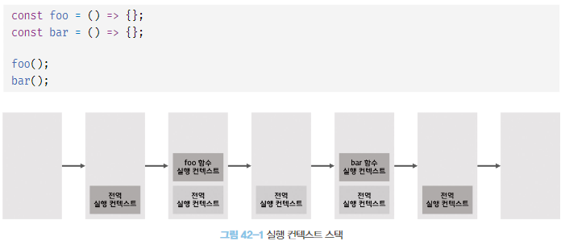

# 42장 비동기 프로그래밍


JS엔진은 하나의 실행 컨텍스트(콜 스택) 스택을 갖기 때문에 2개 이상의 함수를 동시에 실행할 수 없다. --> 싱글 스레드

이 싱글 스레드는 한 번에 하나의 태스크만 실행할 수 있기 때문에 처리에 시간이 걸리는 태스크를 실행하는 경우 블로킹이 발생한다.

### 비동기 처리의 단점

- 콜백 헬을 발생시켜 가독성을 나쁘게 한다
- 비동기 처리 중 발생하 에러의 예외처리가 곤란하다.
- 여러 개의 비동기 처리를 한 번에 처리하는 데 한계가 있다.

## 이벤트 루프와 태스크 큐

자바스크립트의 동시성을 지원하는 것은 이벤트 루프이다.

자바스크립트 엔진

- 콜 스택: 실행 컨텍스트 스택을 말하며 최상위 실행 컨텍스트가 종료되어 콜 스택에서 제거되기 전까지 다른 어떤 태스크 실행 X

- 힙: 객체가 저장되는 메모리 공간, 객체는 크기가 정해져 있지 않아서 메모리 공간의 크기를 런타임에 결정하며 구조화 되어있지 않다는 특징을 가지고 있음.

비동기 처리의 코드 평가와 실행을 제외한 모든 처리는 JS엔진을 구동하는 환경인 브라우저 또는 Node.js가 담당한다.(호출 스케줄링을 위한 타이머 설정 및 콜백 함수 등록은 브라우저 또는 Node.js가 담당 )

- 태스크 큐: setTimeout이나 setInterval과 같은 비동기 함수의 콜백 함수 또는 이벤트 핸들러가 일시적으로 보관되는 영역

- 이벤트 루프: 콜 스택에 현재 실행중인 실행컨텍스트가 존재하는 지 확인하고, 콜스택이 비어있고 태스크 큐에 대기 중인 함수가 존재 시, 순차적으로 태스크 큐에 대기 중인 함수를 콜 스택으로 이동시킨다.

> JS엔진은 싱글스레드로, 브라우저는 멀티 스레드로 동작한다.

# 43장 Ajax

JS를 사용해서 브라우저가 서버에게 비동기 방식으로 데이터를 요청하고, 서버가 응답한 데이터를 수신하여 웹페이지를 동적으로 갱신하는 프로그래밍 방식

Web Api인 XMLHttpRequest 객체를 기반으로 동작하며 이 객체는 HTTP 비동기 통신을 위한 메서드와 프로퍼티를 제공한다.

## Ajax 통신의 장점

- 필요한 데이터만 서버로부터 전송 받아서 효율적
- 변경할 필요가 없는 부분 재 랜더링X -> 순간적으로 깜박이는 현상 없음
- 클라이언트와 서버의 통신이 비동기적으로 동작하여 요청을 보낸 후에 블로킹이 발생하지 않는다.

## JSON

JSON은 클라이언트와 서버 간의 HTTP 통신을 위한 텍스트 데이터 포맷이다.

JSON의 표기 방식
JS의 객체 리터럴과 유사하게 키와 값으로 구성된 순수한 텍스트

키는 무조건 큰 따옴표로 묶고, 값 중에서 문자열은 반드시 큰 따옴표로 묶어야함.

## JSON.stringify

객체 -> JSON 포맷의 문자열

## JSON.parse

JSON 포맷의 문자열 -> 객체

## XMLHtppRequest

JS를 사용하여 HTTP 요청을 전송하려면 XMLHttpRequest 객체를 사용한다. 이 객체는 HTTP 요청 전송 및 응답 수신을 위한 다양한 메서드와 프로퍼티를 제공한다.

XMLHttpRequest 객체 생성
Web API 이므로 브라우저 환경에서만 정상적으로 실행된다.

```javascript
const xhr = new XMLHttpRequest();
```

## HTTP 요청 전송

1. open 메서드로 HTTP 요청 초기화
2. setRequestHeader 메서드로 특정 HTTP 요청의 헤더 값 설정
3. send 메서드로 HTTP 요청 전송

```javascript
const xhr = new XMLHttpRequest();

xhr.open("GET", "/users");

xhr.setRequestHeader("content-type", "application/json");

xhr.send();
```

### XMLHttpRequest.prototype.open

서버에 전송할 HTTP 요청 초기화

### xhr.open(method, url[, async])

method : GET/POST/PUT/DELETE (HTTP 요청 메서드)
url : HTTP 요청을 전송할 URL
async : 비동기 요청 여부, 옵션은 기본값은 true

HTTP 요청 메서드는 클라이언트가 서버에게 요청의 종류와 목적을 알리는 방법

## XMLHttpRequest.prototype.send

send 메서드는 open 메서드로 초기화된 HTTP 요청을 서버에 전송한다.

- GET 요청 메서드의 경우 데이터를 URL의 일부분인 쿼리 문자열로 서버에 전송한다.
- POST 요청 메서드의 경우 데이터(페이로드)를 요청 몸체에 담아 전송한다.
  페이로드가 객체인 경우 반드시 JSON.stringify 메서드를 사용하여 직렬화한 다음 전달!

HTTP 요청 메서드가 GET 인 경우 send 메서드에 페이로드로 전달한 인수는 무시되고 요청 몸체는 null로 설정된다.

## XMLHttpRequest.prototype.setRequestHeader

특정 HTTP 요청의 헤더 값을 설정한다.

Content-type은 요청 몸체에 담아 전송할 데이터의 MIME 타입의 정보를 표현한다.

| MIME 타입   | 서브타입                                           |
| ----------- | -------------------------------------------------- |
| text        | text/plain, text/html, text/css, text,javascript   |
| application | application/json, application/x-www-form-urlencode |
| multipart   | multipart/formed-data                              |

# 44장 Rest API

HTTP의 장점을 최대한 활용할 수 있는 아키텍처이며 이 REST의 기본원칙을 성실히 지킨 서비스 디자인을 "RESTful"이라고 표현한다.

## REST API의 구성

자원, 행위, 표현의 3가지 요소로 구성된다.

- 자원(자원) : URI로 표현
- 행위(자원에 대한 행위) : HTTP 요청 메서드
- 표현(자원에 대한 행위의 구체적 내용) : 페이로드

## REST API 설계 원칙

기본적인 원칙 2가지

1. URI는 리소스를 표현하는데 집중
   행위에 대한 정의는 HTTP 요청 메서드를 통해 하는 것
   URI는 리소스를 표현해야한다 -> 리소스의 이름은 동사보다 명사!

2. 리소스에 대한 행위는 HTTP 요청 메서드로 표현한다 -> GET/POST/PUT/PATCH/DELETE를 사용하여 CRUD 구현

# 45장 프로미스

### 콜백패턴의 단전

- 콜백헬의 가독성 나쁨
- 비동기 처리 중 발생하는 에러처리 곤란
- 여러개의 비동기 처리 한번에 처리하는데 한계

```javascript
const get = (url) => {
  const xhr = new XMLHttpRequest();
  xhr.open("GET", url);
  xhr.send();

  xhr.onload = () => {
    if (xhr.status === 200) {
      console.log(JSON.parse(xhr.response));
      return JSON.parse(xhr.response); // 기대한 대로 동작 X
    } else {
      console.error(`${xhr.status} ${xhr.statusText}`);
    }
  };
};

const response = get("https://jsonplaceholder.typicode.com/posts/1");
console.log(response); // undefined
```

위 함수는 비동기 함수이기 때문에 비동기 함수가 종료된 이후에 완료되므로 함수 내부의 비동기로 동작하는 코드에서 처리 결과를 외부로 반환하거나 상위 스코프의 변수에 할당하면 기대한 대로 동작하지 않는다.

위 상황에서 get 함수의 반환문은 생략되었으므로 암묵적으로 undefined를 반환한다. onload 이벤트 핸들러는 get 함수가 호출하지 않기때문에 이벤트 핸들러의 반환값을 get 함수가 캐치할 수 없고, 상위스코프를 사용한다 하더라도 이벤트 핸들러 프로퍼티에 바인딩한 이벤트 핸들러는 전역코드의 실행이 끝난다음 실행되기 때문에 확인할 수 없다.

### 에러 처리의 한계

```javascript
try {
  setTimeout(() => {
    throw new Error("hi!");
  }, 1000);
} catch (e) {
  console.error("에러", e);
}
```

## 프로미스의 생성

```javascript
const promiseGet = (url) =>
  new Promise((resolve, reject) => {
    const xhr = new XMLHttpRequest();
    xhr.open("GET", url);
    xhr.send();

    xhr.onload = () => {
      if (xhr.status === 200) {
        resolve(JSON.parse(xhr.response));
      } else {
        reject(new Error(xhr.status));
      }
    };
  });

promiseGet("https://jsonplaceholder.typicode.com/posts/1");
```

new 연산자와 함께 Promise를 호출하여 생성. resolve, reject함수를 인수로 받는다.

| 프로미스 상태 정보 | 의미                                  | 상태 변경 조건                   |
| ------------------ | ------------------------------------- | -------------------------------- |
| pending            | 비동기 처리가 아직 수행되지 않은 상태 | 프로미스가 생성된 직후 기본 상태 |
| fulfilled          | 비동기 처리가 수행된 상태(성공)       | resolve 함수 호출                |
| rejected           | 비동기 처리가 수행된 상태(실패)       | reject 함수 호출                 |

생성된 직후의 프로미스는 기본적으로 pending 상태. 비동기 처리 결과에 따라 프로미스의 상태가 변경된다

성공 : resolve -> fulfilled
실패 : reject -> rejected

비동기 처리가 수행된 상태를 settled 상태

## 프로미스 후속처리 메서드

### Promise.prototype.then

두 개의 콜백함수를 인수로 전달받는다.

- 첫 번째 콜백 함수는 프로미스가 fulfilled 상태가 되면 호출된다. -> 콜백함수는 프로미스의 비동기 처리 결과를 인수로 전달받음
- 두 번째 콜백 함수는 프로미스가 rejected 상태가 되면 호출된다. -> 이때 콜백함수는 프로미스의 에러를 인수로 전달받는다.

언제나 프로미스를 반환하고, 콜백 함수가 프로미스 반환 시 그대로 반환하고 아닌 값을 반환하면 그 값을 암묵적으로 resolve, reject 하여 프로미스를 생성해 반환

### Promise.prototype.catch

한 개의 콜백 함수를 인수로 전달받는다. 프로미스가 rejected 상태인 경우만 호출된다.

```javascript
new Promise((_, reject) => reject(new Error("rejected"))).catch((e) =>
  console.log(e)
);
```

언제나 프로미스 반환

### Promise.prototype.finally

한 개의 콜백 함수를 인수로 전달받고, 프로미스의 성공 또는 실패와 상관없이 무조건 한 번 호출된다. 공통적으로 수행해야 할 처리 내용이 있을 때 유용하며 언제나 프로미스를 반환한다.

```javascript
new Promise((resolve) => resolve("fulfilled"))
  .then(
    (v) => console.log(v),
    (e) => console.error(e)
  )
  .finally(() => console.log("finally"));
promiseGet("https://jsonplaceholder.typicode.com/posts/1")
  .then((res) => console.log(res))
  .catch((e) => console.error(e))
  .finally(() => console.log("end"));
```

## 프로미스의 에러 처리

아까 위에서 적은 promiseGet의 resolve, reject는 프로미스를 반환하므로 then, catch, finally등의 후속 처리메서드를 사용할 수 있다.

에러를 처리하는 경우 then 메서드의 두 번째 콜백 함수로 처리하거나 catch를 사용해 처리할 수 있는데, catch 메서드는 내부적으로 then(undefined, onRejcted)를 호출하는 것과 같다.

then은 첫번째 콜백함수에서 발생한 에러를 두번째 콜백함수에서 잡아내지 못하기 때문에 then 메서드보다 catch 메서드를 사용하는 것이 가독성이 좋고 명확하다.

## 프로미스 체이닝

then, catch, finally 후속 처리 메서드는 언제나 프로미스를 반환하기 때문에 연속적으로 호출할수 있고 이를 프로미스 체이닝 이라고 한다.

이 프로미스 체이닝을 통해 비동기 처리 결과를 받아 후속 처리를 하므로 콜백 헬이 발생하지 않는다. 그러나 결국 promise도 콜백 패턴을 사용하므로 콜백함수를 사용하지 않는 것은 아니다.

콜백 패턴은 가독성이 좋지 않은데 이 문제를 async/await를 통해 해결할 수 있다. --> 동기 처리처럼 프로미스가 처리 결과를 반환하도록 함.

```javascript
const url = "https://jsonplaceholder.typicode.com";

(async () => {
  const { userId } = await promiseGet(`${url}/posts/1`);

  const userInfo = await promiseGet(`${url}/users/${userId}`);

  console.log(userInfo);
})();
```

## 프로미스의 정적 메서드

Promise는 주로 생성자 함수로 사용되지만 함수도 객체이므로 메서드를 가지며 5가지 정적 메서드를 제공한다.

### Promise.resolve / Promise.reject

resolve와 reject 메서드는 이미 존재하는 값을 래핑하여 프로미스를 생성하기 위해 사용한다.

인수로 전달받은 값 resolve하는 프로미스 생성

```javascript
Promise.resolve([1, 2, 3]) === new Promise(resolve => resolve([1, 2, 3])));
```

뒤에 then 후속 처리 메서드 붙여서 console.log 찍으면 [1, 2, 3] 나옴
reject도 마찬가지로 인수로 전달 받은 값을 reject 하는 프로미스를 생성한다.

### Promise.all

여러 개의 비동기 처리를 모두 병렬 처리할때 사용한다.

```javascript
Promise.all([requestData1(), requestData2(), requestData3()])
  .then(console.log)
  .catch(console.error);
```

이 메서드는 프로미스를 요소로 갖는 배열 등의 이터러블을 인수로 전달 받는다. 모든 promise가 fulfilled 상태가 되면 모든 처리 결과를 배열에 저장해 새로운 프로미스를 반환한다.

이 메서드가 종료되는 시간은 가장 늦게 fulfilled 상태가 되는 프로미스의 처리 시간보다 약간 더 김(가장 긴 시간이 3초라면 3초 + 알파가 모든 처리에 걸리는 시간)

이 메서드는 첫 번째 프로미스가 resolve한 처리 결과부터 차례대로 배열에 저장하기 때문에 처리 순서가 보장되며 하나라도 rejected 상태가 되면 그 즉시 종료한다.

인수로 전달받은 요소가 프로미스가 아닌 경우 resolve 메서드를 통해 프로미스로 래핑함

### Promise.race

Promise.all 메서드 처럼 동일하게 프로미스를 요소로 갖는 배열 등의 이터러블을 인수로 전달받는다.

가장 먼저 fulfilled 상태가 된 프로미스의 처리 결과를 resolve하는 새로운 프로미스를 반환한다. 그러나 하나라도 rejected 상태가 되면 에러를 reject하는 새로운 프로미스를 즉시 반환한다.(promise.all처럼)

### Promise.allSettled

프로미스를 요소로 갖는 배열 등의 이터러블을 인수로 전달받고 전달받은 프로미스가 모두 settled 상태가 되면 처리 결과를 배열로 반환한다.

- 프로미스가 fulfilled 상태인 경우 비동기 처리상태를 나타내는 status 프로퍼티와 처리 결과를 나타내는 value 프로퍼티를 갖는다
- 프로미스가 rejected 상태인 경우 비동기 처리 상태를 나타내는 status 프로퍼티와 에러를 나타내는 reason 프로퍼티를 갖는다.

## 마이크로태스크 큐

마이크로태스크 큐와 태스트 큐와는 별도의 큐인데 안에 저장되는 것들이 다르다

- 마이크로태스크 큐 : 프로미스의 후속 처리 메서드의 콜백 함수
- 태스크 큐 : 비동기 함수의 콜백함수나 이벤트 핸들러

마이크로태스크 큐가 태스크 큐보다 우선순위가 높다.(콜 스택이 비면 마이크로태스크 큐먼저 확인 후 태스크 큐 진행)

## fetch

etch
XMLHttpRequest 객체와 마찬가지로 HTTP 요청 전송 기능을 제공하는 클라이언트 사이드 API 이다. 사용법이 간단하고 프로미스를 지원하여 콜백 패턴의 단점에서 자유롭다.

fetch 함수는 HTTP 응답을 나타내는 Response 객체를 래핑한 Promise 객체를 반환한다.

response객체는 HTTP 응답을 나타내는 다양한 프로퍼티와 메서드를 제공하는데, MIME 타입이 application/json인 응답 몸체를 취득하려면 Response.prototype.json 메서드를 사용한다.(역 직렬화를 위해)
