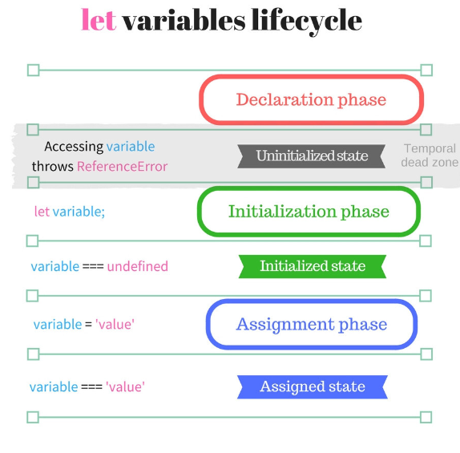

# TDZ

### 변수의 선언 3단계


```javascript
new Car("red"); // Does it work?

class Car {
  constructor(color) {
    this.color = color;
  }
}
```


```javascript
greet("World"); // Does it work?

function greet(who) {
  return `Hello, ${who}!`;
}
```

## TDZ의 영향을 받는 구문



const, let, class, constructor() 내부의 super(), 기본 함수 매개변수

### constructor() 내부의 super()

부모 클래스를 상속받았다면, 생성자 안에서 super()를 호출하기 전까지 this 바인딩은 TDZ에 있다.

```javascript

class MuscleCar extends Car {
  constructor(color, power) {
    this.power = power;
    super(color);
  }
}

// Does not work!
const myCar = new MuscleCar(‘blue’, ‘300HP’); // `ReferenceError`

```

onstructor() 안에서 super()가 호출되기 전까지 this를 사용할 수 없다.

```javascript
class MuscleCar extends Car {
  constructor(color, power) {
    super(color);
    this.power = power;
  }
}

// Works!
const myCar = new MuscleCar("blue", "300HP");
myCar.power; // => '300HP'
```

기본 매개변수는 글로벌과 함수 스코프 사이의 중간 스코프(intermidiate scope)에 위치한다. 기본 매개변수 또한 TDZ 제한이 있다.

```javascript
const a = 2;
function square(a = a) {
  return a * a;
}
// Does not work!
square(); // throws `ReferenceError`
```

기본 매개변수 a는 선언 전에 a = a 표현식의 오른쪽에서 사용되었다. a에서 참조 에러가 발생

```javascript
const init = 2;
function square(a = init) {
  return a * a;
}
// Works!
square(); // => 4
```

## TDZ의 영향 X


var, function, import 구문

```javascript
// Works, but don't do this!
value; // => undefined
var value;

// Works!
greet("World"); // => 'Hello, World!'
function greet(who) {
  return `Hello, ${who}!`;
}

// Works!
greet("Earth"); // => 'Hello, Earth!'

// Works!
myFunction();
import { myFunction } from "./myModule";
```

### typeof

```
function doSomething(someVal) {
  // Function scope
  typeof variable; // => undefined
  if (someVal) {
    // Inner block scope
    typeof variable; // throws `ReferenceError`
    let variable;
  }
}
doSomething(true);
```
